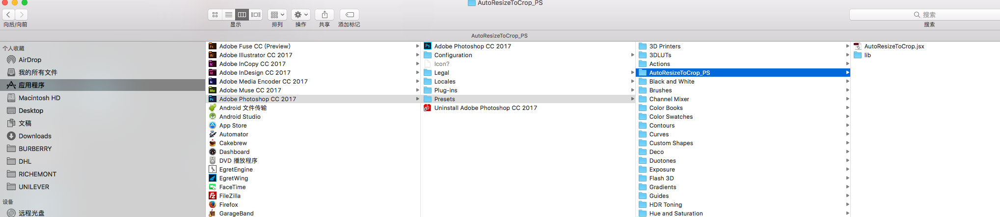
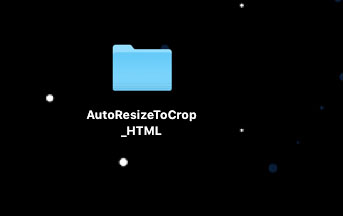
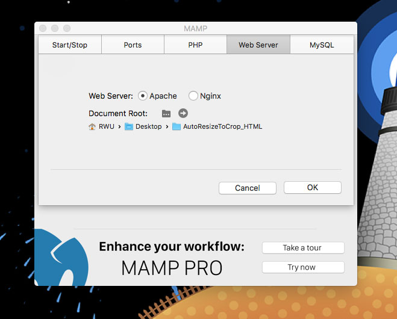
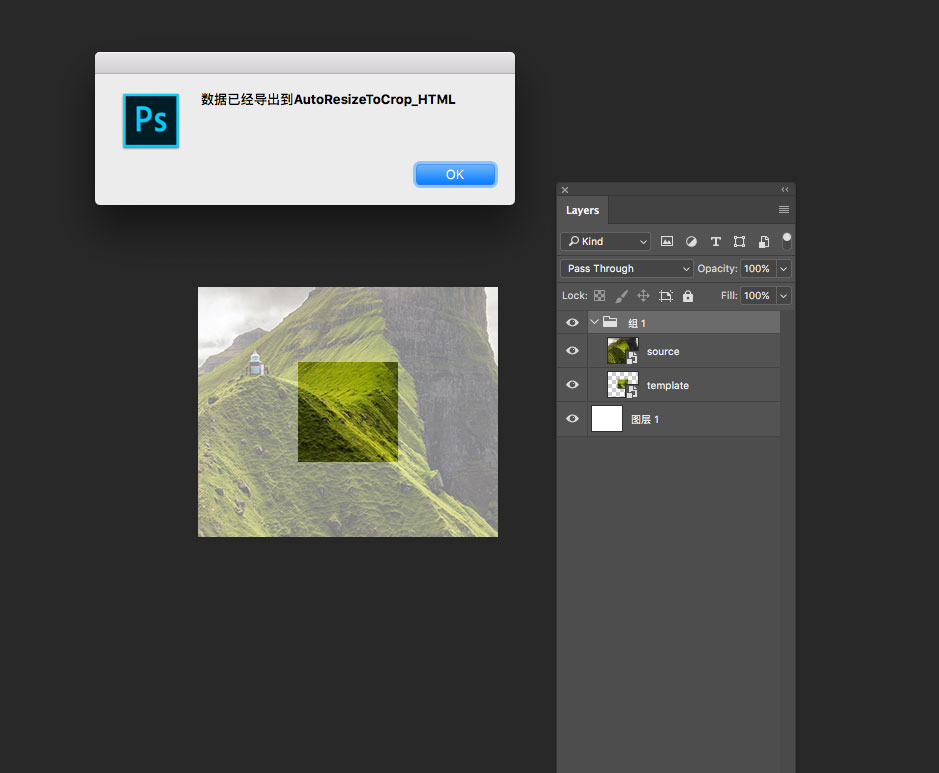
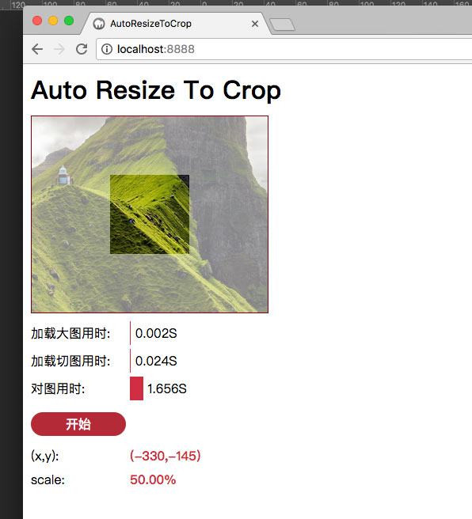
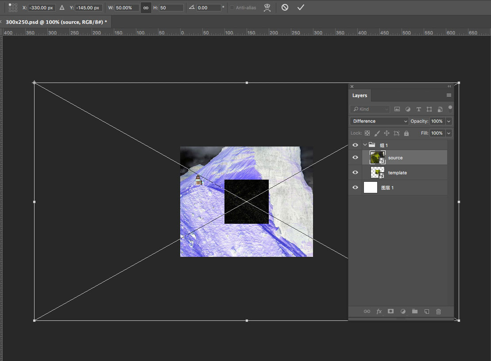
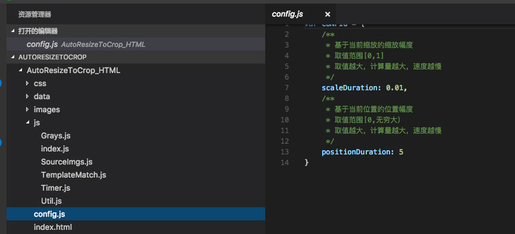

## 1.AutoResizeToCrop是什么?

AutoResizeToCrop是ps对图程序，脚本部分负责已对图数据导出，web部分负责对图。

## 2.如何安装？

以Adobe Photoshop CC 2017和OSX为例

1. 拷贝AutoResizeToCrop_PS文件夹到/Applications/Adobe Photoshop CC 2017/Presets文件夹下

2. 拷贝AutoResizeToCrop_HTML文件夹到桌面

3. 下载MAMP(https://www.mamp.info/en/)或类似程序，搭建基于AutoResizeToCrop_HTML的网站

4. 在ps里选择包含大图和切图的组,执行脚本

5. 在网站点击开始按钮或敲回车，等待计算结果

6. 将计算结果输入ps，检查对图效果

## 3.让程序做的更多

AutoResizeToCrop基于已对图数据进行进一步对图（模板匹配）

如果想让程序计算更多，自己少对点图，可以根据实际情况调整配置参数

